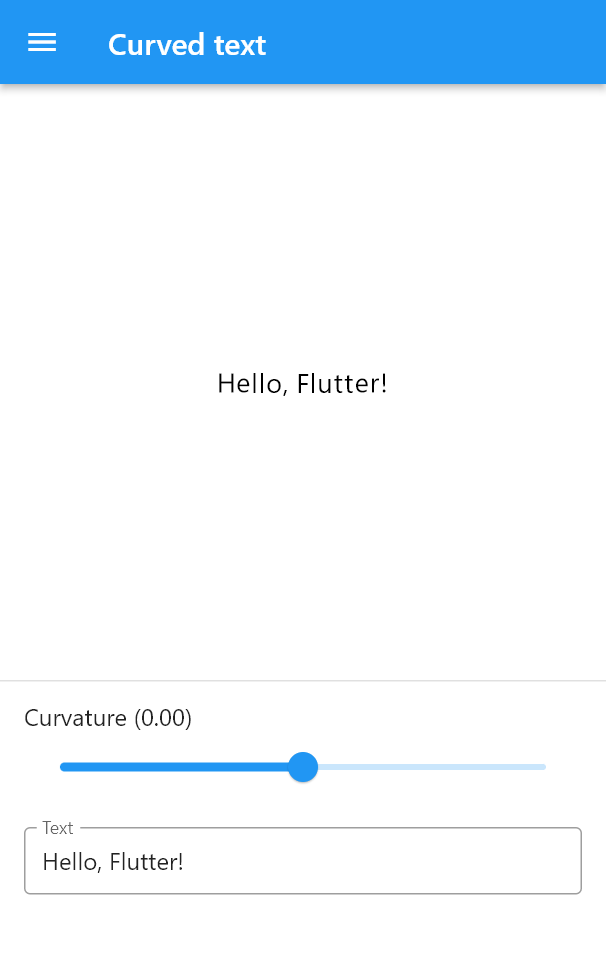
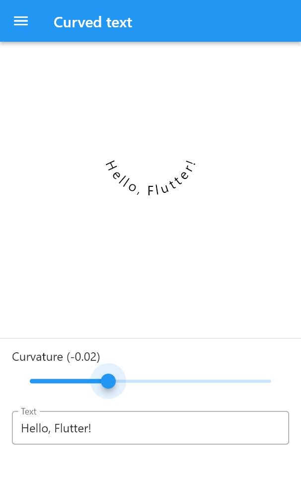
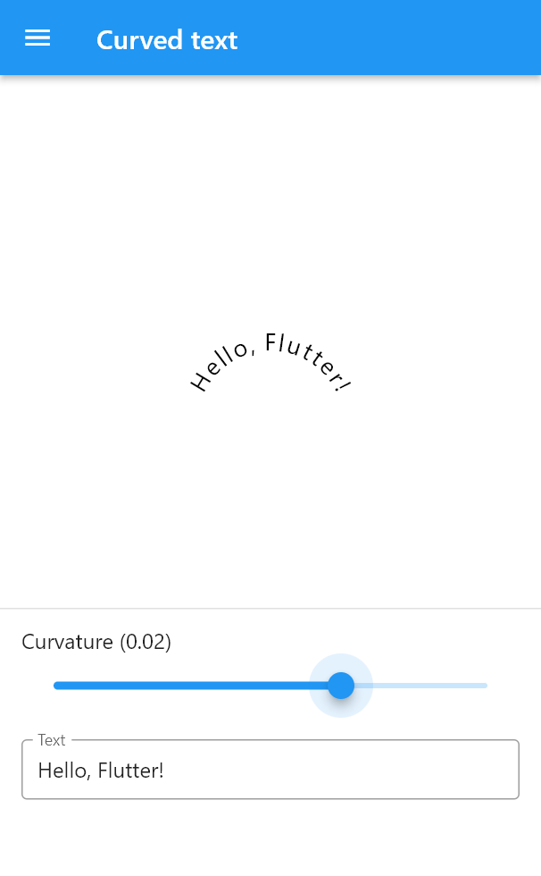

Curved text widget. You do not have to worry about a larger circle, 
you just curl your widget in place.

## Features

Given a curvature (1/radius), a text string and a text style, creates a 
curved text in the center of the space defined by parent's constraints.  

|   |   |   |
|---|---|---|

## Getting started

Just place it in a widget with size constraints and the text (not the center 
of a virtual circle) will be centered in it and will be curved in place. 

## Usage

```dart
return CurvedText(
    curvature: 0.02,
    text: 'Hello, Flutter!',
    textStyle: TextStyle(fontSize: 18, color: Colors.black),
);
```

## Additional information

Uses the https://pub.dev/packages/flutter_arc_text widget.
